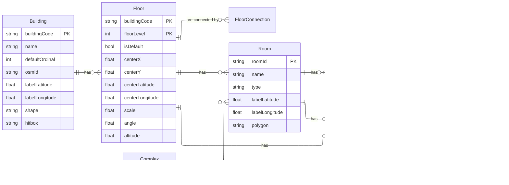

## Database

We use Postgres for the database. The database is hosted on Railway. Use docker compose for local Postgres instance.

### Database Model

### How to access the database

Use PgAdmin, which can connect to the DB through Railway's internal network and limits login retries for safety.

Passwords are stored in Railway. Hosted in the following locations for each environment

- Dev: https://pgadmin.maps.slabs-dev.org/browser/
- Staging: to be set up
- Prod: to be set up

## S3 Bucket

Will created schemas in the dataflow folder.